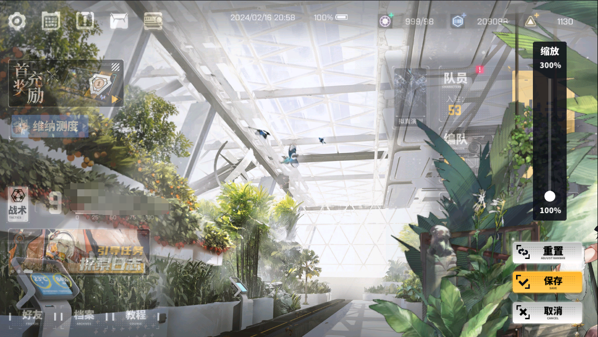

# 2024.02.16 更新

基于[CrossCore-Luascripts-Uncensored](https://github.com/AXiX-official/CrossCore-Luascripts-Uncensored)的[2024.02.16](https://github.com/AXiX-official/CrossCore-Luascripts-Uncensored/releases/tag/2024.02.16)版本修改。

## 修改

- 修改角色查看界面的缩放范围，从`0.7,1.3`修改为`1.0,3.0`。
- 解除角色查看界面的拖动范围限制（不然会因为修改缩放范围而无法拖动至边缘）。
  - 需要替换`Custom`下的`prefabs_uis_role`和`prefabs_uis_croledisplay`文件以解除拖动范围限制。

## 修改的文件

- `cfgglobal_settingl.lua`
- `prefabs_uis_role`
- `prefabs_uis_croledisplay`

## 修改的内容

- 修改前
  - `{'1317',	'g_CardLookScale',	'',	'float[]',	'0.7,1.3'},`
  - `{'1327',	'g_MutiLookScale',	'',	'float[]',	'0.8,1.3'},`
- 修改后
  - `{'1317',	'g_CardLookScale',	'',	'float[]',	'1.0,3.0'},`
  - `{'1327',	'g_MutiLookScale',	'',	'float[]',	'1.0,3.0'},`

## 修改效果

